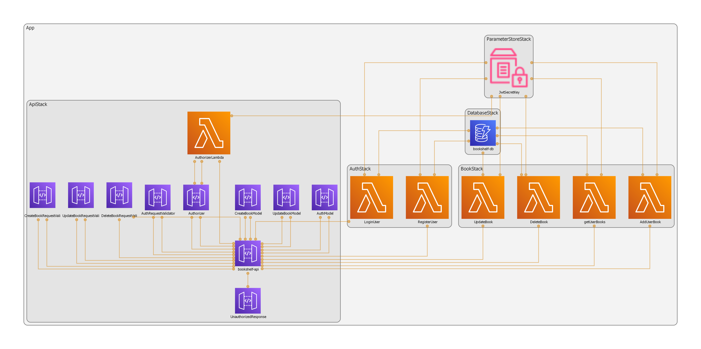

# Bookshelf (Serverless Version)

A serverless version of **Bookshelf**, a personal management app that helps you organize, track, and plan your reading.  

This version is built with **AWS CDK**, integrating multiple AWS services.  
- You can see the demo of the original application running in the README of [ahmedyoussefg/bookshelf](https://github.com/ahmedyoussefg/bookshelf).


## Archeticture and Implementation Details

### Architecture Diagram


> Used `cdk-dia` to generate the diagram.

### Overview

- DynamoDB:
    - Used **DynamoDB** to store all application data with a **single-table design**. 
    - First, I defined the **access patterns** for the app and identified the indexes I’d need.
    Here’s the table of access patterns:
    
    - Example of actual items stored in the DB: 
    

- AWS Lambda:
    - Each API Gateway resource is backed by a **Lambda function handler**. 
    - A **custom Lambda Authorizer** validates JWT tokens from the `Authorization` header before requests reach the `/user/books*` handlers.  

- AWS Parameter Store:
    - Used **SSM Parameter Store** to keep the `JWT_SECRET_KEY`.  
    - I could have used AWS Secrets Manager, but for a learning project, Parameter Store was cheaper.  

- AWS API Gateway:
    - Front door to all backend APIs, routing requests to Lambda functions.
    - Configured **CORS** for the Vercel frontend.  
    - Integrated with a **Lambda Authorizer** to validate JWT tokens.  
    - Added **GatewayResponse** for `401` so unauthorized error responses also include CORS headers.

## Deployment Steps

```bash
# navigate to backend folder
cd backend

# install dependencies
npm install

# bootstrap CDK (once)
cdk bootstrap

# deploy all stacks
cdk deploy --all
```